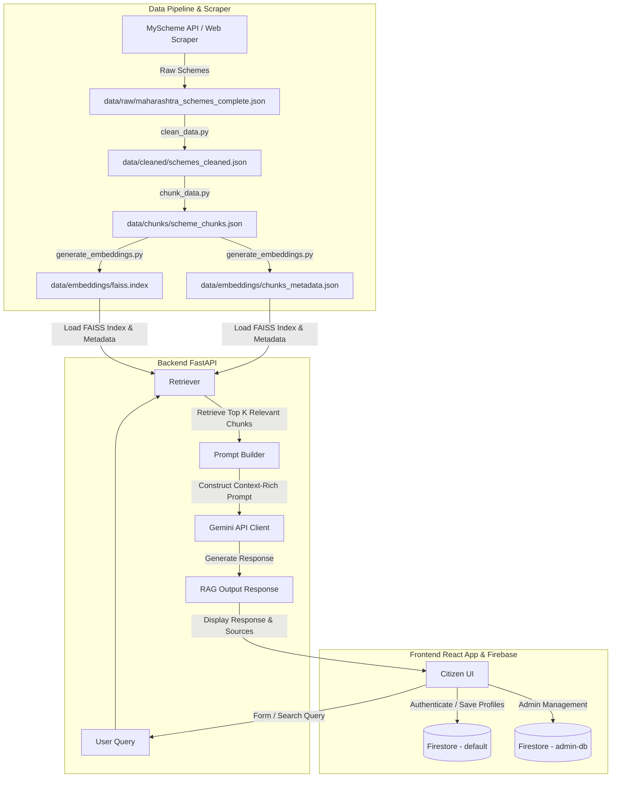

# Yojana Sarthi 🇮🇳 — AI-Powered Citizen Scheme Portal

[](https://react.dev)
[](https://fastapi.tiangolo.com)
[](https://deepmind.google/technologies/gemini/)
[](https://github.com/facebookresearch/faiss)
[](https://firebase.google.com)
[](LICENSE)

> Yojana Sarthi is an intelligent, RAG-powered (Retrieval-Augmented Generation) portal designed to help Indian citizens (specifically tailored for Maharashtra Welfare Services) seamlessly discover, check eligibility for, compare, and apply for central and state government schemes.

---

## 🏗️ System Architecture & Data Flow

Yojana Sarthi leverages a Retrieval-Augmented Generation (RAG) pipeline to fetch contextually relevant government scheme documentation and present it dynamically to citizens without LLM hallucinations.



---

## 🌟 Key Features

### 🖥️ Citizen Frontend (React + Vite)
*   🔍 **Advanced Scheme Finder**: Search schemes using natural language queries or filter dynamically by profile demographics (age, annual income, occupation, category, gender).
*   📋 **Direct Benefit Transfer (DBT) Tracker**: Track welfare payouts and see specific disbursement criteria.
*   🤖 **AI Assistant**: Converse with the RAG-powered chatbot to query detailed rules, applications, and instructions for any scheme.
*   📑 **Document Advisor**: Instant eligibility checker recommending the exact documentation list required for applications.
*   ⚖️ **Scheme Comparison**: Side-by-side comparison of benefits, eligibility requirements, and implementation rules across multiple schemes.
*   ⚠️ **Rejection Predictor**: Automatically flags potential disqualifications by verifying user demographics against scheme constraints.
*   🎙️ **Voice Interface**: Multilingual speech recognition support for voice-enabled queries.
*   🗣️ **Multilingual Settings**: Adjust UI language and speech preferences for Marathi, Hindi, and English.
*   👤 **Onboarding & User Profiles**: Guides users through profile setup to automatically personalize scheme recommendations.
*   🛡️ **Admin Portal**: Dedicated administrator workspace using a separate named Firestore instance (`admin-db`) to manage scheme databases and audit logs.

### ⚙️ RAG Backend (FastAPI + FAISS + Gemini)
*   ⚡ **FastAPI Web Framework**: Asynchronous, high-performance API endpoints for chat, recommendations, and eligibility checks.
*   🧠 **FAISS Similarity Search**: Dense vector retrieval based on the `all-MiniLM-L6-v2` Sentence Transformer for quick and accurate content lookup.
*   🤖 **Google Gemini Integration**: Powered by Gemini models utilizing the official `google-genai` client, complete with custom retries and JSON fallback validation.
*   🔬 **Extensive Verification Suite**: Automated tests (`test_pipeline.py`, `test_retriever.py`, `test_gemini.py`) to validate LLM generation and retrieval relevance.

---

## 📂 Repository Directory Structure

```text
├── .github/                # GitHub configurations and workflows
│   └── workflows/          # Workflows directory (empty / provisioned for CI/CD)
├── assets/                 # Logo and visual media assets
├── backend/                # FastAPI Application
│   ├── database/           # DB scripts and models (Firebase & schema storage)
│   ├── middleware/         # Custom API middlewares (CORS, logging)
│   ├── rag/                # Vector search, prompt builders, and Gemini integrations
│   │   ├── gemini_client.py   # Interface to Google Gemini API
│   │   ├── prompt_builder.py  # Context-rich system prompt compiler
│   │   ├── rag_pipeline.py    # Main pipeline coordinating retriever & LLM
│   │   ├── retriever.py       # Sentence-Transformers search engine
│   │   └── vector_store.py    # FAISS local index loader
│   ├── routes/             # API Router definitions (chat, schemes, admin, etc.)
│   ├── services/           # Underlying business logic modules (eligibility, translation, speech)
│   ├── tests/              # Core unit tests
│   ├── app.py              # FastAPI main server entry point
│   ├── config.py           # Application settings, model parameters, and global paths
│   └── schemas.py          # Pydantic data schemas for API requests/responses
├── data/                   # Embedded, raw, chunked, and cleaned scheme files
├── docs/                   # General project documentation
├── frontend/               # React + Vite Single Page Application (SPA)
│   ├── src/                # Source files
│   │   ├── components/     # Reusable UI widgets and layout templates
│   │   ├── pages/          # Individual feature pages (AIAssistant, Profile, Admin, etc.)
│   │   ├── services/       # API call wrappers (api.js)
│   │   ├── styles/         # Page-specific CSS styling
│   │   ├── App.jsx         # Component router and dashboard layout
│   │   ├── firebase.js     # Firebase connection wrapper (auth, citizen db, admin db)
│   │   └── main.jsx        # App entry point
│   └── vercel.json         # Deployment configuration for Vercel hosting
├── scraper/                # Web scraping and data parsing pipeline
│   ├── chunk_data.py       # Divides scheme details into context-aware chunks
│   ├── clean_data.py       # Preprocesses raw JSON payloads
│   ├── fetch_maharashtra.py# Downloads Maharashtra welfare schemes
│   └── generate_embeddings.py # Builds local FAISS index from scheme chunks
└── requirements.txt        # Full python environment requirements list
```

---

## 🚀 Getting Started

### Prerequisites
- Node.js (v18+) & npm
- Python 3.10+
- A Google Gemini API Key

---

### 📦 1. Backend Setup & Run

1.  **Navigate into the backend folder and create a virtual environment**:
    ```bash
    cd backend
    python -m venv .venv
    # Activate virtual environment:
    # Windows (PowerShell):
    .venv\Scripts\activate.ps1
    # macOS/Linux:
    source .venv/bin/activate
    ```

2.  **Install dependencies**:
    ```bash
    pip install -r ../requirements.txt
    ```

3.  **Configure Environment Variables**:
    Create a `.env` file in the root project directory:
    ```env
    GEMINI_API_KEY=your_google_gemini_api_key_here
    ```

4.  **Run Pipeline Tests**:
    Verify that retrieval and Gemini integrations are working properly:
    ```bash
    python test_pipeline.py
    ```

5.  **Start the FastAPI Server**:
    ```bash
    uvicorn app:app --reload --port 8000
    ```

---

### 💻 2. Frontend Setup & Run

1.  **Navigate into the frontend folder**:
    ```bash
    cd ../frontend
    ```

2.  **Install dependencies**:
    ```bash
    npm install
    ```

3.  **Start the local development server**:
    ```bash
    npm run dev
    ```
    The application will run locally at `http://localhost:5173`.

---

### 🧹 3. Scraper & Embedding Pipeline

To fetch, clean, chunk, and index schemes manually from the project root:

1.  **Clean Raw Scheme Data**:
    ```bash
    python scraper/clean_data.py
    ```
2.  **Create Section-wise Chunks**:
    ```bash
    python scraper/chunk_data.py
    ```
3.  **Generate FAISS Index and Embeddings**:
    ```bash
    python scraper/generate_embeddings.py
    ```

---

## 📜 License

This project is licensed under the MIT License. See the [LICENSE](LICENSE) file for details.
