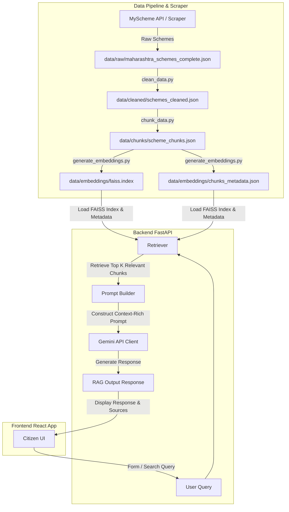

# Yojana Sarthi 🇮🇳 — AI-Powered Citizen Scheme Portal

[](https://react.dev)
[](https://fastapi.tiangolo.com)
[](https://deepmind.google/technologies/gemini/)
[](https://github.com/facebookresearch/faiss)
[](LICENSE)

> An AI-powered platform to help Indian citizens (specifically focused on Maharashtra Welfare Services) discover, verify eligibility, compare, and apply for central and state government schemes.

---

## 🏗️ System Architecture & Data Flow

Yojana Sarthi leverages a Retrieval-Augmented Generation (RAG) pipeline to query and extract answers directly from official scheme documents without hallucinating information.



---

## 🌟 Key Features

### 🖥️ Citizen Frontend
*   🔍 **Advanced Scheme Finder**: Search schemes by natural language query or filter by profile demographics (age, annual income, occupation, category, gender).
*   📋 **Direct Benefit Transfer (DBT) Tracker**: Keep tabs on welfare payouts and disbursement criteria.
*   🤖 **AI Assistant**: Chat with the RAG-powered Yojana Sarthi chatbot to query specific scheme regulations and instructions.
*   📑 **Document Advisor**: Instant eligibility checker recommending required documentation for applications.
*   ⚖️ **Scheme Comparison**: Side-by-side comparison of benefits, eligibility, and rules across multiple schemes.
*   ⚠️ **Rejection Predictor**: Analyzes applicant details against scheme constraints to estimate potential rejection risks.
*   🎙️ **Voice Interface**: Multilingual speech support for voice-enabled queries.
*   🗣️ **Multilingual Settings**: Adjust preferences for Marathi, Hindi, and English support.

### ⚙️ RAG Backend
*   ⚡ **FastAPI Web Framework**: High-performance asynchronous routes for chat, recommendations, and eligibility checks.
*   🧠 **FAISS Similarity Search**: Dense vector retrieval based on the `all-MiniLM-L6-v2` Sentence Transformer.
*   🤖 **Google Gemini Integration**: Powered by `gemini-3.6-flash` utilizing the official `google-genai` client with error-handling and automated retries.
*   🔬 **Extensive Test Pipeline**: Dedicated unit and performance tests (`test_gemini.py`, `test_pipeline.py`, etc.) for validating the retriever and LLM outputs.

---

## 📂 Repository Directory Structure

```text
├── .github/workflows/    # CI/CD pipelines for Backend and Scraper
├── assets/               # Media and logo assets
├── backend/              # FastAPI Application
│   ├── rag/              # Vector search, prompt builders, and Gemini integrations
│   ├── routes/           # Chat, eligibility, admin, translate, and scheme endpoints
│   ├── tests/            # System unit tests
│   ├── app.py            # FastAPI main server entry point
│   └── config.py         # Application settings, model parameters, and global paths
├── data/                 # Raw, cleaned, chunked, and embedded schemes databases
├── docs/                 # General project documentation
├── frontend/             # React + Vite SPA
│   ├── src/pages/        # Scheme search, RAG chat, comparison, and advisor pages
│   ├── src/components/   # Reusable UI widgets and layout templates
│   └── src/styles/       # UI theme custom styling
├── models/               # Model weights storage
└── scraper/              # Data collection and cleaning scripts
```

---

## 🚀 Getting Started

### Prerequisites
- Node.js (v18+) & npm
- Python 3.10+
- A Google Gemini API Key

---

### 📦 1. Backend Setup & Run

1.  **Navigate into the backend folder and create a virtual environment**:
    ```bash
    cd backend
    python -m venv .venv
    # Activate virtual environment:
    # Windows:
    .venv\Scripts\activate
    # macOS/Linux:
    source .venv/bin/activate
    ```

2.  **Install dependencies**:
    ```bash
    pip install -r ../requirements.txt
    ```

3.  **Configure Environment Variables**:
    Create a `.env` file in the root directory:
    ```env
    GEMINI_API_KEY=your_google_gemini_api_key_here
    ```

4.  **Run Pipeline Tests**:
    To verify that retrieval and LLM responses are functioning correctly:
    ```bash
    python test_pipeline.py
    ```

5.  **Start the FastAPI Server**:
    ```bash
    uvicorn app:app --reload --port 8000
    ```

---

### 💻 2. Frontend Setup & Run

1.  **Navigate into the frontend folder**:
    ```bash
    cd ../frontend
    ```

2.  **Install dependencies**:
    ```bash
    npm install
    ```

3.  **Start the local development server**:
    ```bash
    npm run dev
    ```
    The app will open locally at `http://localhost:5173`.

---

### 🧹 3. Scraper & Embedding Pipeline

To ingest, clean, chunk, and embed new schemes manually, run the following steps from the project root:

1.  **Clean Raw Scheme Data**:
    ```bash
    python scraper/clean_data.py
    ```
2.  **Create Section-wise Chunks**:
    ```bash
    python scraper/chunk_data.py
    ```
3.  **Generate FAISS Index and Embeddings**:
    ```bash
    python scraper/generate_embeddings.py
    ```

---

## 📜 License

This project is licensed under the MIT License. See the [LICENSE](LICENSE) file for details.
